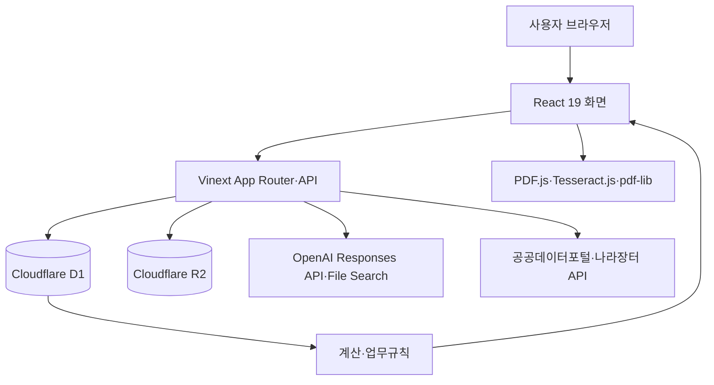

# 계약ON

> 견적서 검토부터 품의·계약·착공·공사진행·준공·검사검수·하자관리까지 학교 공사계약 업무를 하나의 흐름으로 연결하는 교육행정 업무지원 웹 애플리케이션

- 서비스: [계약ON 바로가기](https://edu-contract-companion-2026.workspace-309431.chatgpt.site)
- 현재 상태: MVP 개발 및 기능 검증 진행 중
- 애플리케이션 버전: `0.1.0`

## 1. 프로젝트 개요

계약ON은 학교 공사계약 담당자가 견적서, 계약서류, 기준자료와 행정문서를 각각 확인하며 반복 입력하던 업무를 줄이기 위해 개발한 웹 애플리케이션입니다.

견적서와 단계별 제출서류에서 정보를 추출하고, 등록된 행정 지식과 코드로 작성된 규칙에 따라 검토한 뒤, 확인된 정보를 계약 현황판·행정문서·현장 체크리스트·공사대장·하자대장에 재사용합니다.

이 프로젝트는 모든 판단을 생성형 AI에 맡기지 않습니다.

- 문서 내용 추출과 자연어 질의에는 AI를 사용합니다.
- 금액 계산, 요율 적용, 단계 전환과 일정 산정에는 규칙 엔진을 사용합니다.
- 근거가 없거나 자동 판정이 어려운 항목은 담당자가 직접 확인·수정·확정합니다.
- 시스템 결과는 행정 판단을 지원하는 참고자료이며 최종 판단은 업무 담당자가 수행합니다.

## 2. 개발 목적

- 견적서의 공사정보·업체정보·금액을 반복 입력하는 작업 감소
- 노임단가와 법정경비·제비율 검토 과정의 누락 및 계산 오류 감소
- 계약 단계별 제출서류와 업무 진행상태의 통합 관리
- 한 번 구조화한 계약정보를 품의서, 내부기안문, 체크리스트와 대장에 재사용
- 등록된 내부자료만 근거로 답변하는 지식검색 환경 제공
- 개인정보가 포함된 문서를 분석 전에 가릴 수 있는 사전 마스킹 기능 제공

## 3. 주요 사용자

- 학교 행정실의 공사계약 업무 담당자
- 신규 또는 저경력 교육행정 공무원
- 공사 진행·준공·하자 일정을 관리하는 행정실장과 관련 담당자

## 4. 전체 업무 흐름


계약 진행단계는 다음과 같이 관리됩니다.

1. 품의
2. 내부기안
3. 계약 체결
4. 원인행위
5. 착공
6. 공사중
7. 준공
8. 검사검수
9. 공사완료

## 5. 현재 구현된 기능

### 5.1 견적서 업로드와 정보 추출

- 지원 형식: PDF, XLSX, XLS, DOCX, CSV
- 파일 크기 제한: 15MB
- 공사명, 공종, 공사목적, 업체명, 사업자등록번호, 업체 전화번호와 공사기간 추출
- 총액, 공급가액, 부가가치세, 재료비, 직접·간접노무비, 경비, 법정경비, 일반관리비와 이윤 구조화
- XLSX·CSV는 로컬 셀 텍스트 추출 경로를 우선 사용하여 분석시간 단축
- 동일 파일은 파일 해시 기반 분석 캐시 사용
- 필수 기본정보와 추출금액을 사용자가 직접 수정 가능
- 공사명에 따라 건축·전기·소방·방송통신 공종 제안
- 공사명을 바탕으로 공사목적을 제안하되 사용자가 수정 가능
- 저장된 견적서를 다시 분석하는 기능
- 분석 및 검토 완료 후 담당자가 승인해야 계약 현황판에 등록
- 검토 후 입력값이 바뀌면 재검토가 필요하도록 일관성 확인

### 5.2 개인정보 사전 마스킹

- 견적서, 계약서류, 착공서류와 준공서류 업로드 영역에서 사용
- 텍스트·XLSX·DOCX 문서의 개인정보 패턴 마스킹
- PDF 텍스트 레이어 탐지와 스캔 페이지 OCR 보조 탐지
- PDF에서 사용자가 여러 영역을 지정하는 직접 드래그 마스킹
- `pdf-lib`를 이용한 마스킹 영역 반영과 평탄화
- 착공 관련 서류에서 성명, 생년월일과 직위를 대상으로 하는 문맥 규칙 적용
- 일반 날짜와 현장배치기간은 마스킹 대상에서 제외하도록 처리
- 구형 XLS 파일의 직접 마스킹은 현재 지원하지 않음

### 5.3 견적서 검토

- 총액, 공급가액, 부가가치세와 세부 합계의 산술 일치 여부 확인
- 등록된 노임단가 자료에서 직종명을 찾아 견적단가와 비교
- 간접노무비, 기타경비, 일반관리비와 이윤의 산식 및 상한금액 계산
- 고용보험료·산재보험료 등 사회보험 요율 검토
- 금액이 0원이거나 공란인 적용 항목은 `해당 없음`으로 처리
- 전기·통신·소방·전문·기타 공사의 공통 적용 메모 반영
- 잘못 추출된 법정경비 금액을 사용자가 직접 수정한 뒤 재검토 가능
- 적용 요율, 산식, 등록기준액, 견적금액, 차이와 근거자료 표시
- 노무비는 직종별 등록 기준단가와 견적단가를 화면에서 비교
- 재료비는 자동 적합·부적합 판정에서 제외하고 별도 가격조회 기능으로 분리

### 5.4 나라장터·공공데이터 연계

- 사업자등록번호를 이용한 나라장터 부정당제재업체 조회
- 사업자등록번호 체크섬 확인 후 공식 API 호출
- 조달청 나라장터 가격정보현황 서비스 기반 자재 기준가격 검색
- 자재명·규격 정규화와 일치점수에 따른 후보 정렬
- 노무 직종은 자재가격 조회 대상에서 제외
- 외부 API 오류가 기존 견적서 검토 결과에 영향을 주지 않도록 분리

### 5.5 관련 감사사례 안내

- 등록된 `공사계약 Q&A 및 사례연습(2025. 6.)_감사사례만.md`를 파싱하여 사용
- 공사명, 공종, 공사금액과 공사기간을 기준으로 규칙 기반 관련도 계산
- 관련성이 높은 사례만 표시하며 관련성이 낮은 사례는 제외
- 사례를 보여주는 이유를 현재 공사정보와 연결하여 표시
- 상세 보기에서 관련 규정과 실제 감사사례를 구분하여 표시
- 생성형 AI가 자료에 없는 감사사례를 만들지 않음

### 5.6 계약 현황판과 단계 관리

- 계약 목록, 현재 단계, 진행률, 다음 할 일과 일정 표시
- 착공일·준공일·하자일정 기반 D-Day 안내
- 단계 변경 이력 저장
- 계약 상세 화면에서 업무 단계별 탭 제공
- 진행 중 공사 삭제 기능
- 업무 완료 후 다음 단계 화면으로 이동

### 5.7 품의·기안 문서

- 공사계획서, 에듀파인 품의내용과 내부기안문 초안 생성
- 현재 계약정보를 등록된 양식에 반영
- 계약방법 근거검색과 추천결과 표시
- 담당자 최종 계약방법은 수정 가능하며 기본값은 `나라장터 전자계약`
- 화면에서 내용 수정, 저장과 복사 가능
- HWP 파일 직접 생성 기능은 현재 없음

### 5.8 계약·착공·준공서류 확인

- 단계별 여러 파일 업로드와 삭제
- 하나의 PDF에 여러 종류의 서류가 포함되어 있어도 전체 페이지를 읽어 분류
- 등록된 체크리스트와 비교하여 제출완료, 누락, 확인필요와 해당없음으로 구분
- 업무상 동의어 처리
  - 착공계 = 착공신고서
  - 공사공정예정표 = 예정공정표
  - 현장기술자 지정신고서 = 현장대리인계
- 자동 분석결과가 없어도 담당자가 실제 서류를 확인한 경우 단계 완료 가능
- 파일 삭제 시 해당 단계의 이전 검토결과 초기화
- 준공서류에서 관련 견적금액이 0원이거나 기준 미달인 서류는 해당없음 처리

### 5.9 나라장터 실습 안내

- 계약서류와 원인행위 사이에 나라장터 안내 화면 제공
- 업무 구분별 실습 이미지 93장 제공
- 이전·다음 화면 이동과 큰 화면 보기 지원

### 5.10 공사진행 확인

- 공통 확인사항과 공종별 현장 체크리스트 제공
- 정상, 확인필요, 해당없음 상태 선택
- 확인 메모, 조치내용, 사진 첨부와 조치완료 표시
- 학생 안전요소, 디자인·색상, 친환경 자재 등 학교 현장 확인항목 포함
- 체크리스트 인쇄와 이전 확인이력 조회
- 확인 완료 후 준공서류 단계로 이동

### 5.11 검사검수·대금지급

- 에듀파인 검사검수, 수도광열비 안내공문 발송과 대금지급 완료를 각각 확인
- 수도·전기료 계산
- 전기수도료 납부 내부기안문 초안 생성과 복사
- 작성일 기준 납부기한 자동 계산
- `31.수도전기료계산식` 형식의 Excel 파일 다운로드
- 공사완료 처리 후 하자관리 단계로 이동

### 5.12 하자관리와 대장

- 등록된 하자기간 기준에서 공종별 하자담보기간과 보증금률 선택
- 담당자가 기준, 시작일과 하자보증 방법을 확인한 뒤 확정 또는 재확정
- 하자보증 방법은 지급각서 또는 보증보험 중 선택
- 종료일까지 6개월 간격으로 정기 하자검사 일정 생성
- 하자검사 완료 처리와 메모 저장
- 공사대장·하자대장 XLSM 다운로드
- 제공된 양식에 현재 계약정보를 채우고 필요한 대장 시트만 표시

### 5.13 지식관리

- 지원 형식: PDF, DOCX, XLSX, XLSM, CSV, TXT, MD
- 문서명을 입력하지 않으면 파일명으로 자동 작성
- 일반 업로드 15MB, 대용량 원본은 최대 200MB 분할 업로드
- 원본은 R2, 문서 메타데이터와 처리상태는 D1에 저장
- 지식목록 가나다순 표시와 삭제
- 색인 대기, 처리완료, 오류와 재시도 상태 관리
- Excel 계열과 CSV는 검색 가능한 텍스트로 변환한 뒤 색인
- OpenAI Vector Store와 File Search를 이용한 검색
- 현재 지식관리 메뉴는 구현되어 있으나 관리자 전용 접근권한은 아직 적용되지 않음

### 5.14 AI 업무비서

- 독립 AI 업무비서 화면과 모든 화면에서 사용할 수 있는 플로팅 질문창 제공
- Enter 키로 질문 전송
- 등록된 지식자료에서 검색된 근거만 사용하여 답변
- 근거를 찾지 못하면 임의로 답을 생성하지 않고 근거 부족으로 응답
- 답변에 사용한 문서와 근거정보 저장
- 서울특별시교육청 계약길잡이의 공사계약 업무흐름 링크 제공

### 5.15 서울교육사이트 찾기

- 교육행정 업무 분야와 세부업무 기준으로 관련 사이트 탐색
- 업무지도와 목록보기 제공
- 사이트명, 운영기관, 로그인 안내, 확인일과 주의사항 표시
- 사이트 운영상태에 따른 바로가기 제공

## 6. AI와 규칙 엔진의 역할

| 기능 | AI 사용 | 규칙·코드 사용 | 담당자 확인 |
| --- | --- | --- | --- |
| 견적서 분석 | 문서에서 항목과 금액 추출 | 합계 검증, 캐시, 필드 정규화 | 추출값 수정·확정 |
| 노임·제비율 검토 | 근거문서 검색 보조 | 직종 매칭, 산식, 상한 판정 | 적용기준 최종 확인 |
| 제출서류 확인 | 묶음 문서의 종류 분류 | 체크리스트, 동의어, 적용 제외 | 누락 여부 확인·단계 완료 |
| 지식 챗봇 | 질문 해석과 근거 기반 답변 | 근거 존재 여부 검사 | 답변의 업무 적용 판단 |
| 감사사례 추천 | 사용하지 않음 | 키워드·공종·금액 규칙 | 사례 활용 여부 판단 |
| 일정·하자관리 | 사용하지 않음 | 단계와 날짜 계산 | 기준·일자 확정 |

## 7. 시스템 구조



### 데이터 저장

- **Cloudflare D1**: 계약정보, 단계이력, 견적 분석·검토, 제출서류 검토, 지식 메타데이터, 체크리스트와 하자일정
- **Cloudflare R2**: 견적서, 지식자료와 계약·착공·준공 업로드 파일 원본
- **OpenAI File·Vector Store**: 등록된 지식자료의 검색용 색인
- **사용자 브라우저**: PDF 렌더링, OCR 보조, 마스킹 미리보기와 직접 영역 지정

주요 데이터 테이블은 다음과 같습니다.

- `contracts`, `contract_stage_history`
- `quotation_analyses`, `quotation_items`
- `quotation_reviews`, `quotation_review_items`
- `administrative_documents`
- `contract_document_files`, `contract_document_reviews`, `contract_document_review_items`
- `knowledge_documents`, `knowledge_settings`, `knowledge_queries`
- `construction_checklist_runs`, `construction_checklist_items`
- `contract_warranties`, `warranty_criteria`, `warranty_inspections`
- `ai_decision_audit`

## 8. 기술 스택

| 구분 | 사용 기술 |
| --- | --- |
| 프론트엔드 | React 19, TypeScript, CSS |
| 애플리케이션 | Vinext, Vite 8, App Router 방식 |
| 실행·호스팅 | OpenAI Sites, Cloudflare Workers |
| 데이터베이스 | Cloudflare D1, Drizzle ORM |
| 파일 저장소 | Cloudflare R2 |
| AI | OpenAI Responses API, File Search, Vector Store |
| PDF·OCR | PDF.js, pdf-lib, Tesseract.js |
| 문서 처리 | fflate와 자체 파서 |
| 외부 데이터 | 공공데이터포털 나라장터 부정당제재·가격정보 API |
| 테스트 | Node.js test runner, 프로덕션 빌드 검증 |

## 9. 프로젝트 구조

```text
.
├─ app/                 # 화면, 레이아웃과 서버 API 라우트
│  ├─ api/              # 견적·계약·지식·나라장터 API
│  ├─ assistant/        # AI 업무비서
│  ├─ contracts/        # 계약 현황판과 상세 업무화면
│  ├─ estimates/        # 견적 분석·검토 결과
│  ├─ knowledge/        # 지식관리
│  └─ navigator/        # 서울교육사이트 찾기
├─ components/          # 업로드, 검토, 마스킹과 단계별 UI
├─ data/                # 업무규칙용 정적 데이터와 사이트 데이터
├─ db/                  # D1 스키마와 초기화 SQL
├─ lib/                 # 추출, 계산, 지식검색과 일정 업무 로직
├─ public/              # 이미지, 실습화면과 대장 양식
├─ tests/               # 업무규칙·API·회귀 테스트
├─ worker/              # Cloudflare Worker 진입점
└─ .openai/             # Sites 호스팅 설정
```

## 10. 로컬 실행 방법

### 요구사항

- Node.js 22.13.0 이상
- npm
- OpenAI API 키
- D1·R2 로컬 바인딩을 실행할 수 있는 환경

### 설치와 실행

```bash
npm install
npm run dev
```

환경변수는 `.env.example`을 참고하여 로컬 환경파일에 설정합니다.

```powershell
Copy-Item .env.example .env.local
```

### 환경변수

| 변수 | 필수 여부 | 용도 |
| --- | --- | --- |
| `OPENAI_API_KEY` | 필수 | 견적서·제출서류 분석과 지식검색 |
| `OPENAI_MODEL` | 선택 | 문서 분석 모델, 기본값 `gpt-5.6` |
| `OPENAI_CHAT_MODEL` | 선택 | 지식 챗봇 모델, 기본값 `gpt-5.6-luna` |
| `DATA_GO_KR_SERVICE_KEY` | 가격조회 사용 시 필수 | 나라장터 가격정보현황 서비스 인증키 |
| `DATA_GO_KR_API_KEY` | 부정당제재 조회 시 필수 | 공공데이터포털 인증키 및 기존 호환 변수 |

인증키는 브라우저 코드에 넣지 않고 서버 환경변수로만 설정해야 합니다. 실제 인증키와 `.env*` 파일은 Git에 커밋하지 않습니다.

## 11. 빌드와 테스트

```bash
# 정적 검사
npm run lint

# 프로덕션 빌드
npm run build

# 빌드 후 전체 테스트
npm test
```

테스트 범위는 다음과 같습니다.

- 견적 금액 계산과 제비율 판정
- 노임 직종 매칭과 최신 기준표 선택
- 0원·공란 항목의 해당없음 처리
- 검토 후 입력값 변경 감지
- 단계별 서류 체크리스트와 동의어 매칭
- 개인정보 마스킹 패턴과 PDF 처리
- 계약 단계 전환과 D-Day 계산
- 6개월 단위 하자검사 일정
- 감사사례 관련도 계산
- 나라장터 API 응답 정규화와 자재 후보 매칭
- 공사대장·하자대장과 수도전기료 파일 생성

현재 확인된 전체 회귀 테스트는 **154개**입니다.

## 12. 현재 개발 상태

### 구현 완료

- 견적서 업로드, 구조화, 수정, 재분석과 규칙 기반 검토
- PDF 자동·직접 마스킹과 문서 업로드 전 사전 처리
- 계약 현황판과 9단계 업무흐름
- 품의·내부기안·공사계획서 초안
- 계약·착공·준공서류 분류와 체크리스트 확인
- 공사진행 현장 체크리스트와 인쇄
- 검사검수·수도전기료·대금지급·공사완료 처리
- 하자기간 확정, 정기검사 일정과 공사·하자대장 생성
- 지식자료 업로드·색인·검색과 근거 기반 AI 업무비서
- 부정당제재업체와 자재 가격정보 조회
- 관련 감사사례 연결
- 나라장터 실습 안내와 서울교육사이트 찾기

### 운영 전 보완 필요

- **사용자·학교별 데이터 분리**: ChatGPT 인증 헤더를 읽는 보조 코드는 있으나 현재 페이지와 API에서 사용자별 접근을 강제하지 않습니다.
- **관리자 권한**: 지식관리 메뉴를 관리자만 수정하도록 제한하는 권한체계는 아직 구현되지 않았습니다.
- **다기관 운영 보안**: 학교별 조직, 역할, 감사로그와 데이터 보존·파기 정책은 `[확인 필요]`입니다.
- **민감정보 보호 검증**: 자동 마스킹은 보조 기능이므로 업로드 전 사람이 결과를 확인해야 합니다.
- **외부 서비스 의존성**: OpenAI와 공공데이터포털의 키, 사용한도, 장애와 응답형식 변경에 영향을 받습니다.
- **문서 형식**: HWP 직접 생성과 범용 PDF 문서 출력 기능은 현재 제공하지 않습니다.
- **브라우저 성능**: 대용량 PDF OCR과 마스킹 시간은 사용자 기기 성능에 따라 달라질 수 있습니다.

## 13. 개인정보와 보안 처리 원칙

- API 인증키는 서버 환경변수에만 저장합니다.
- 업로드 전 브라우저에서 개인정보를 가릴 수 있는 기능을 제공합니다.
- 원본과 마스킹 사본을 구분하고 분석에는 마스킹된 파일을 우선 사용합니다.
- 계약 및 지식 원본은 R2에, 구조화 데이터는 D1에 저장합니다.
- AI 판단, 사용자 수정과 최종값을 감사용 데이터로 기록하는 구조가 포함되어 있습니다.
- 다기관용 접근통제와 개인정보 처리방침은 완성되지 않았으므로 실제 공동사용 전 별도 보안 검토가 필요합니다.

## 14. 개발 원칙

- 새로운 기준값을 코드에 임의로 추가하지 않고 등록된 기준자료와 출처를 확인합니다.
- 계산 가능한 항목은 생성형 AI 응답보다 테스트 가능한 규칙으로 구현합니다.
- 자동 판독 실패 시 사용자가 값을 고칠 수 있는 경로를 유지합니다.
- 단계 완료는 시스템의 자동 판단만으로 처리하지 않고 담당자의 확인을 거칩니다.
- 기능 수정 후 전체 테스트를 실행하여 기존 업무흐름의 회귀 여부를 확인합니다.

## 15. 라이선스

이 저장소의 배포·재사용 라이선스는 아직 명시되어 있지 않습니다. `[확인 필요]`
